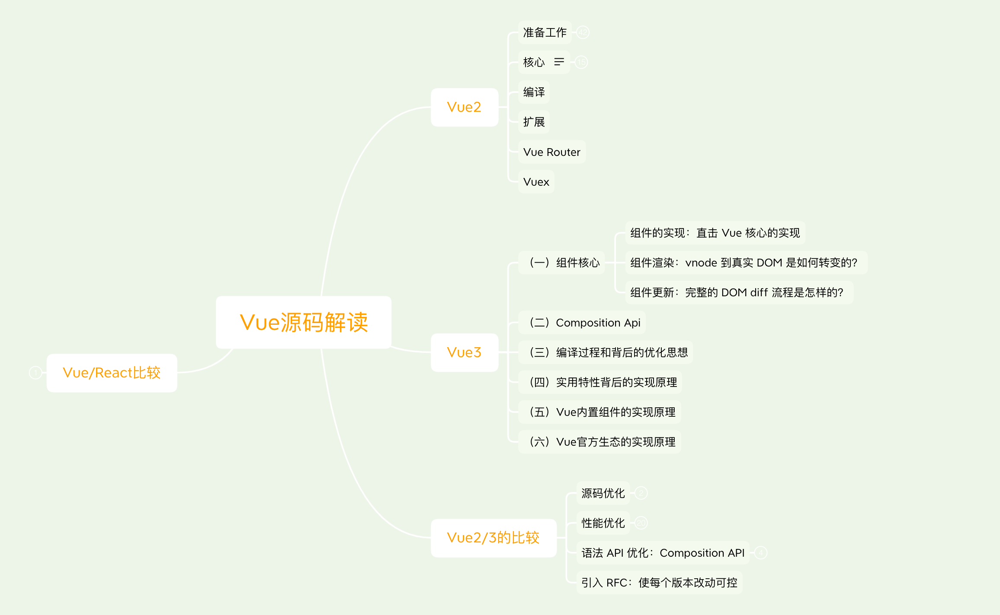

# vue-source-analysis
🍎 Vue2/3源码学习笔记

## 学习链接
- [黄奕老师的Vue2源码全方位深入解析慕课网视频](https://coding.imooc.com/learn/list/228.html)  
- [Vue.js技术揭秘](https://ustbhuangyi.github.io/vue-analysis/)
- [Vue.js 3.0 核心源码解析](https://kaiwu.lagou.com/course/courseInfo.htm?courseId=326#/content)
